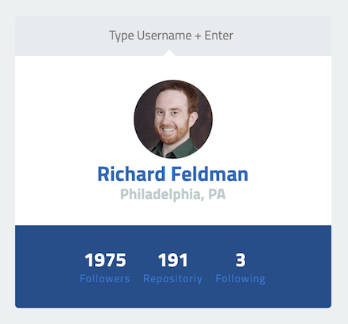
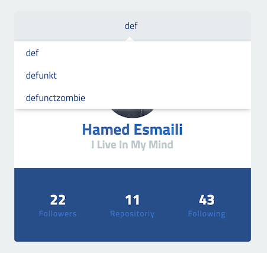

# GitHub User Autocomplete

Your task is to create a user lookup autocomplete in Elm using the public
[GitHub user search API](https://api.github.com/search/users?q=), according to
the screenshots below. You should be able to enter a username and get back some
basic information about that user.

## Instructions

1. Clone the repo and `yarn` to install the necessary dependencies. This
repo uses `create-elm-app` to set up a basic project with an HMR-supported
dev server. See [that project's README](https://github.com/halfzebra/create-elm-app/tree/master/template)
if you run into any issues during installation.

1. `cd project && yarn` and then `yarn elm-app-start` to start the dev server.
Run `yarn watch-css` in a separate terminal to compile the Sass. Navigate to
[http://localhost:3000](http://localhost:3000) in your browser (if it doesn't
automatically open).

1. You are not required to use any external packages, but should you wish to
do so you can install Elm packages with `yarn elm-app-install <package-name>`.
To install JavaScript packages, use `yarn add <package-name>` as usual.

1. You can query the API endpoint with a query param named `q`, e.g.
`https://api.github.com/search/users?q=rtfeldman`. Limit the autocomplete
results to the first three matches. You are free to decide how many characters
should constitute a match (fuzzy matching is not required). Clicking a result
should populate the user's name, location, followers, and respositories in the
widget. (**Note:** You do _not_ need to implement `Enter` or arrow key
functionality in the autocomplete).

1. Bonus: Display a nicely formatted error message if no user matching the
input could be found.

## Screenshots

